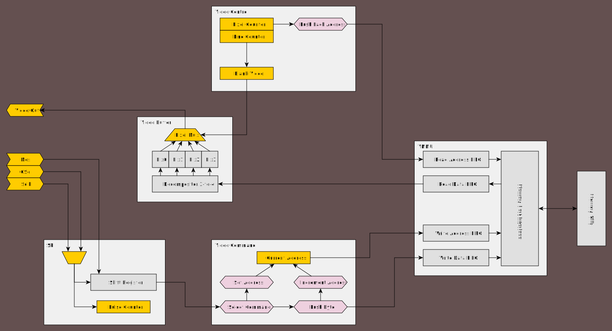

# VGA FPGA Video Card implementation



## Display

This module works in standard VGA mode of 640x480 at 60Hz monitor refresh rate. The picture itself was scaled down to 320x240, but can be reverted to be true 640x480.

Full specification:

```
pixel clock: 25MHz
-0.7% deviation from ideal 25.175MHz

pixel mode: RGB222 6bpp
max analog color output voltage: 0.6V
sync signal level: 3.3V
```

## Hardware

### CAUTION

SPI connection requires 3.3V voltage level for safe operation

---

Apart from standard VGA connector, there is a SPI connection:

```
[  GND ]--(1)
< CSEL ]--(2)
< MOSI ]--(3)
< SCLK ]--(4)
```

FPGA:
```
MIMAS SPARTAN6 MODULE
```

Memory:
```
IS61LV5128AL 512K x 8 HIGH-SPEED CMOS STATIC RAM
access max time: 10, 12ns
full read/write max time: <20ns 
```

## Video memory

The video memory access is handled by module `vmmu.v`, which coordinates read access by VGA display unit and write access by SPI interface.

The basic working mechanism is the use of FIFOs to queue request addresses and read/write data.
Then the module can alternate between executing read and write requests, or if only one source has an active request, only that source is being processed.

The usage of FIFOs also make the system memory independent of other video circutry in terms of clock domains, further making the design more flexible.

## Schematics

As of recent update I've recovered KiCAD schematics and PCB design that contained system memory, SPI input and VGA connector. Those can be found under `kicad` directory.


## Modules

- spi.v - 8-bit SPI sampling receiver
- vbuf.v - video output buffer, also able to read 3 packed bytes to 4 pixels
- vcmd2v.v - video command processor, interacts with received data from SPI
- vctl.v - video output counter unit, sends signals related to video signal blanking and issues pixel read requests
- vsig.v - generates HSync and VSync VGA signals, along with global blank signal
- fifo.v - First-In-First-Out, asynchronous queue, with Full/Empty signals
- seqfifo.v - Generates sequences of addresses from staring address behaving as regular FIFO
- vmmu.v - video memory managment unit, time-slots reads and writes, controls memory chip
- vga.v - top-level module

## Bugs

#### 320x240 picture resolution (unsolved)

This was a hardware fault that prevented me from using a full 640x480. It turned out that one of the address lines was busted and it basically could corrupt the whole lower half of the screen. In theory I such issue could be remedied remap that region to an area that didn't use that address line.

#### PCB design mistake (fixed)

Due to confusing and just plain wrong schematic of pin headers that was published on Mimas site, one of data lines ended up connected to chip ground. This required an ad hoc jumper wire to be connected to a new location on a pin header, and a previous trace to be cut.

## Example driver code

### Coming soon